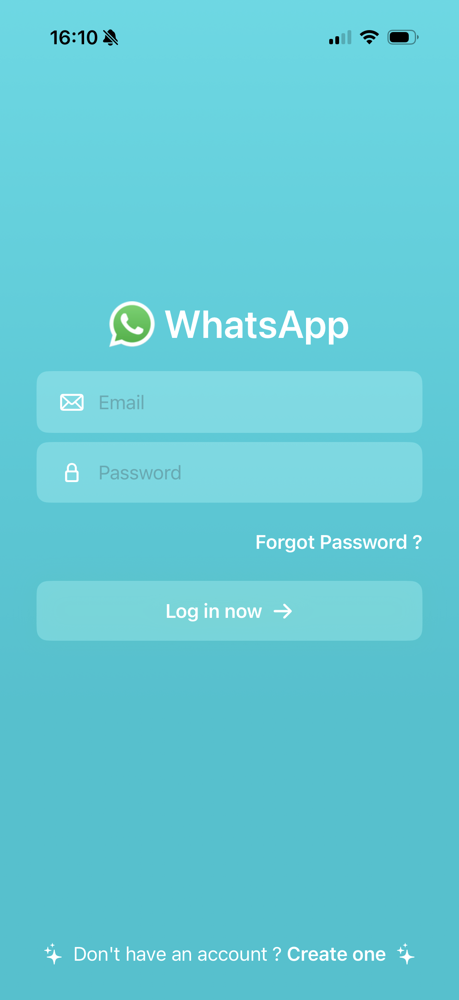
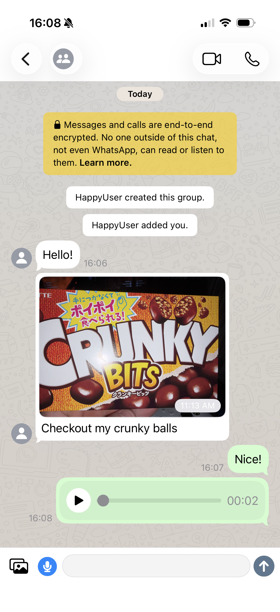
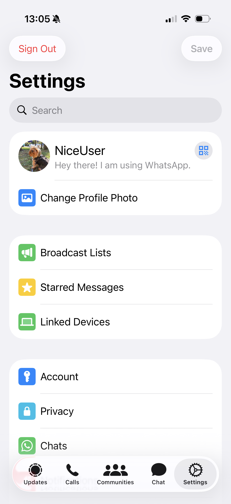
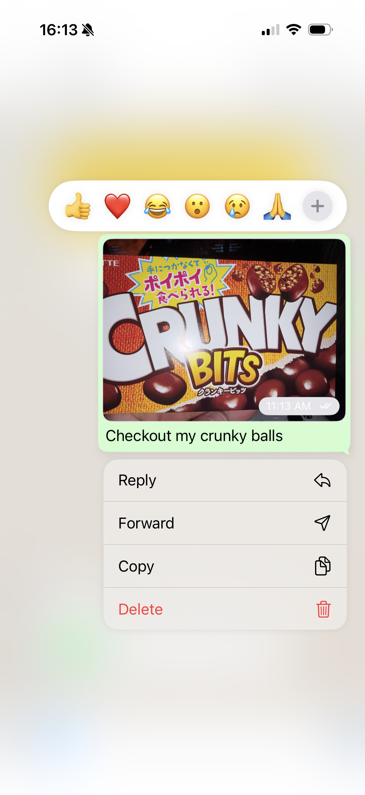

# WhatsAppClone

[](https://swift.org)
[](https://developer.apple.com/ios/)
[](LICENSE)

A WhatsApp-style real-time messaging app for iOS, built with **SwiftUI** and **Firebase**.

## Screenshots

| Auth | Chat | Settings | Reactions |
| :--: | :---: | :------: | :-------: |
|  |  |  |  |

## Features

- **Authentication:** email/password sign up, login, and auto-login via Firebase Auth
- **Real-time messaging:** one-to-one and group chats backed by Firebase Realtime Database
- **Rich media:** send photos, videos, and voice messages, with an in-app media player
- **Reactions:** react to messages with a long-press reaction picker and haptics
- **Groups:** create groups, pick participants, and set a group name
- **Push notifications:** new-message and reaction notifications via Firebase Cloud Functions + APNs
- **Profile & settings:** update display name, bio, and profile photo
- **Video calling:** Stream Video SDK integration

## Architecture

- **`WhatsAppClone/`** — the iOS app, organised by feature under `Screens/` (Auth, Chat,
  Channel, Settings, etc.), with shared `Services/`, `Components/`, `Extensions/`, and `Helpers/`.
- **`Backend/`** — Firebase project configuration and Cloud Functions (`functions/index.js`)
  that send push notifications and mint per-user Stream tokens.

## Getting Started

### Prerequisites

- Xcode 15.2 or later
- An iOS Simulator or device
- A free [Firebase](https://firebase.google.com) project
- Optional: a [Stream](https://getstream.io) account for video calling

### 1. Clone

```bash
git clone https://github.com/tmrff/whatsapp-clone-swiftui.git
cd whatsapp-clone-swiftui
```

### 2. Set up Firebase (bring your own)

This repo does **not** ship a `GoogleService-Info.plist`, you provide your own so the app
talks to your Firebase project.

1. Create a project in the [Firebase Console](https://console.firebase.google.com).
2. Add an iOS app using the bundle id `tmrff.WhatsAppClone` (or change the bundle id in Xcode
   and use your own).
3. Enable **Authentication → Email/Password**.
4. Create a **Realtime Database** and apply the rules in [`Backend/database.rules.json`](Backend/database.rules.json).
5. Enable **Storage** (for media messages).
6. Download the generated `GoogleService-Info.plist` and place it at
   `WhatsAppClone/GoogleService-Info.plist`. (This path is git-ignored.)

### 3. Open and run

```bash
open WhatsAppClone.xcodeproj
```

Select the `WhatsAppClone` scheme and run on a simulator.

### 4. Backend (optional — push notifications & video)

The Cloud Functions handle push notifications and Stream token issuance.

```bash
cd Backend
npm install --prefix functions
cp functions/.env.example functions/.env   # then fill in your Stream API key + secret
firebase use your-firebase-project-id
firebase deploy --only functions,database
```

Push notifications additionally require an APNs key configured in Firebase Cloud Messaging and a
paid Apple Developer account.

## Limitations

- **Video calling is disabled by default.** The Stream Video SDK is integrated, but per-user
  tokens must be minted server-side (via the `getStreamUserToken` Cloud Function). Wiring the
  app to fetch that token is left as a follow-up — see `AuthProvider.setUpStreamVideo`.
- The Updates, Community, and Calls tabs are partial/placeholder UI.


## License

Distributed under the MIT License. See [LICENSE](LICENSE) for more information.
